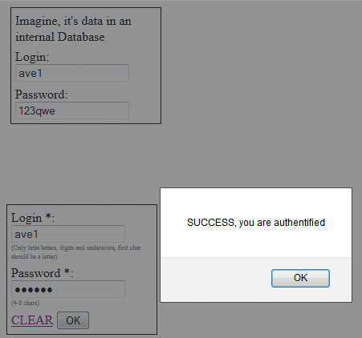

---
title: Тестовое задание на позицию QA инженера
layout: single
classes: wide
---

**Copyright! Приведённый ниже текст является собственностью компании АО "Стек Софт" его использование или публикация в открытых ресурсах не допускается без письменного согласия компании.**

Нужно протестировать [форму авторизации](test_sample_auth_form.html)

верхние 2 поля - "данные в БД"

нижние 2 поля - сама форма

## Задача

* Перечислить все найденные ошибки/дефекты (можно кратко) с указанием
критичности.
* Перечислить тест-кейсы
* Написать 2-3 bug report-а.
* Написать 2-3 тест-кейса по этой форме авторизации.

Можно задавать вопросы, если понадобится по email: pws #собака stacksoft.ru

Пример заполнения данных формы для положительного сценария 

