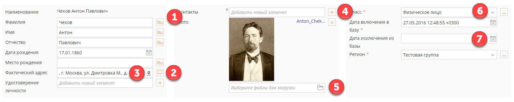

---
title: Тестовое задание на позицию Frontend инженера
layout: single-copy
classes: wide
author_profile: true
author: Pavel Shiryaev
---

## Frontend

**Цель:** сверстать форму, добавить немного адаптивности и интерактивности

**Инструменты:** jquery, bootstrap. Можно, и даже нужно, использовать jquery ui и jquery widget. При верстке хорошо бы задействовать flexbox. Иконки можно использовать любые, например fontavesome, цвета взять со скриншота.

**Задача:** Сверстать форму, добавить функционал кнопкам (см. комментарии). Макет формы см. в приложенном файле screenshot1. В случае недостаточной ширины экрана блоки должны выстраиваться друг под другом, см. screenshot2. Минимальная ширина input и select 250px. label и его input должны оставаться на одной строке.

**Комментарии:** см. скриншот

1. Кнопка добавления языка. При нажатии под полем появляется input для ввода значения и select с языками (ru, en и т.п.)
1. Кнопка добавления комментария. При нажатии появляется всплывающее окно для ввода комментария
1. Ссылка на яндекс карту в новом окне
1. Кнопка добавления нового значения. При нажатии появляется input для ввода значения и кнопка удалить
1. input type file
1. select c вариантами значения. рядом условная кнопка открытия записи в новом окне
1. Выпадающий календарь

## Backend

Написать процедуру на Python, обрабатывающую данные формы из первой части. Считаем что на вход приходит словарь "data". Необходимо проверить данные, убедиться что все обязательные поля заполнены, даты являются датами, склеить из фамилии, имени и отчества ФИО. В случае неудачи процедура должна вернуть понятную ошибку, в случае успеха - словарь проверенных данных

