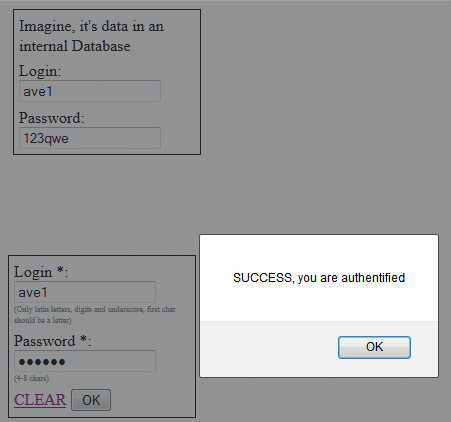

---
title: Тестовое задание на позицию QA инженера
layout: single-copy
classes: wide
author_profile: true
author: Pavel Shiryaev
---

## Описание

Нужно протестировать [форму авторизации](test_sample_auth_form.html){:target="_blank"}

верхние 2 поля - "данные в БД"

нижние 2 поля - сама форма

## Задача

* Перечислить все найденные ошибки/дефекты (можно кратко) с указанием критичности.
* составить чек-лист тестирования формы
* Написать 2-3 bug report-а.

Пример заполнения данных формы для положительного сценария 

